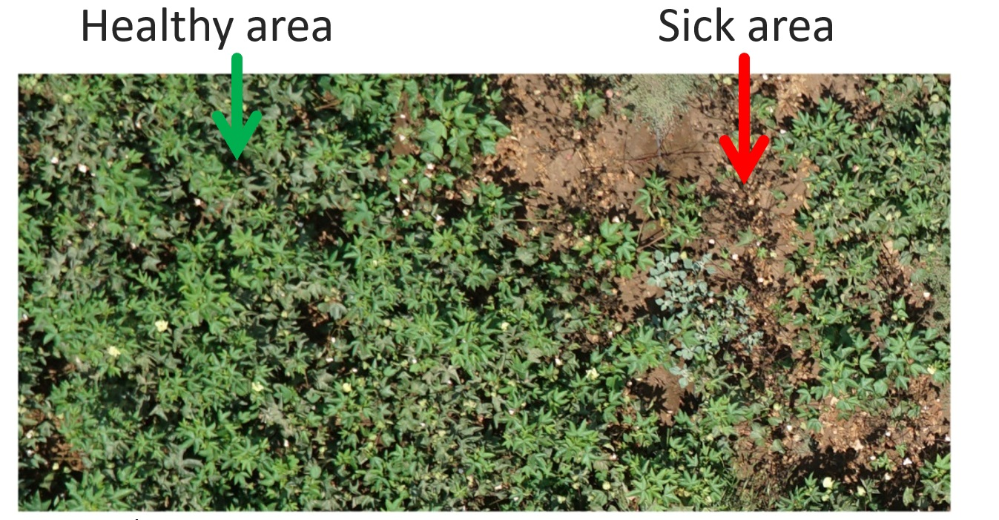
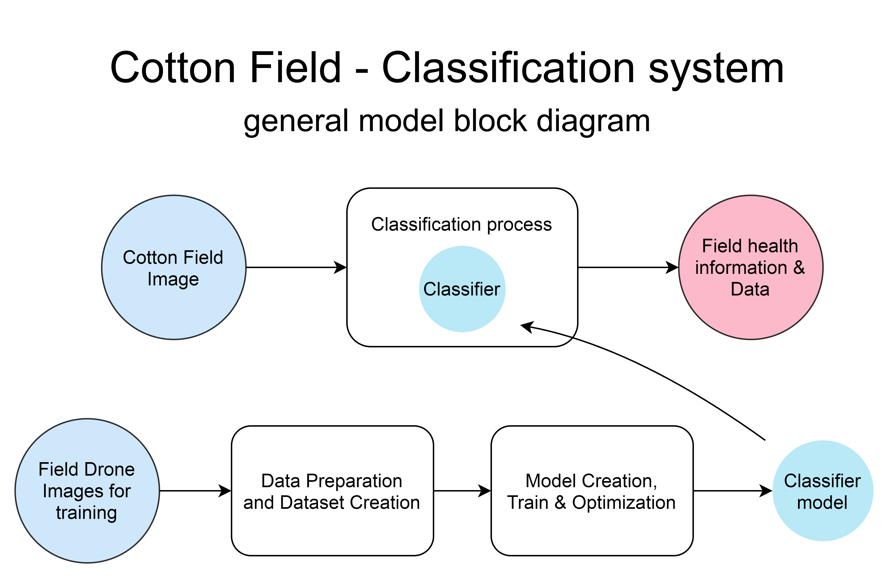
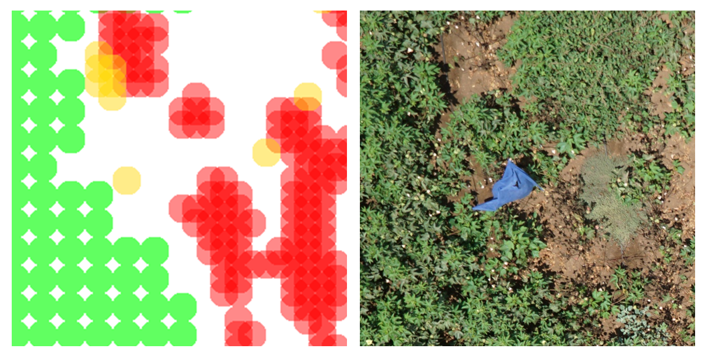
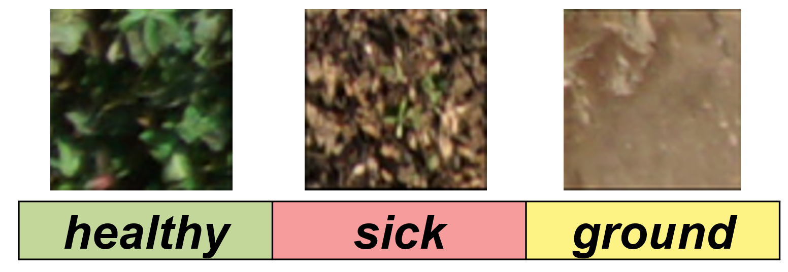
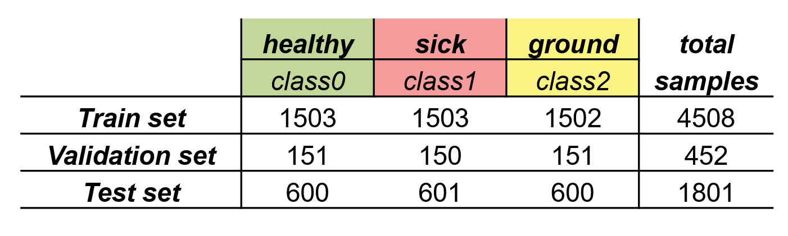
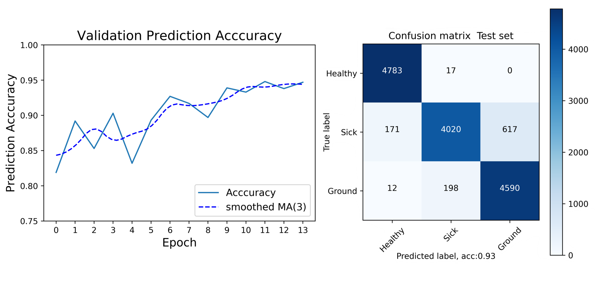
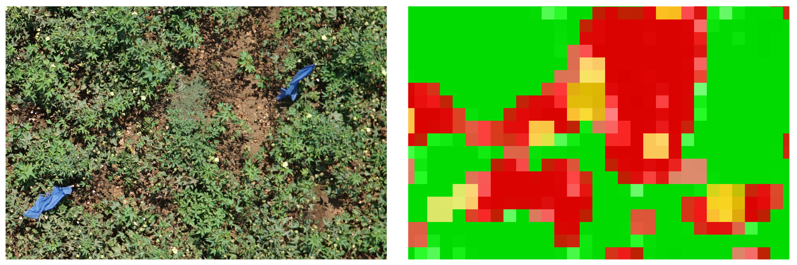

# Anomaly Detection in Cotton Fields Overview
Project with Agricultural Research Organization, Volcani Center and  **Tel-Aviv University, Israel.**

## Introduction
Monitoring an agricultural fields can be a complicated problem.
 A mature field looks like dense and large carpet.
 When a field is ill or being attacked by a pest, it begins in a small area in the field. 
 This area may be far from the edges of the field, unobservable from the ground, 
 and it can be very harmful to the farmer.
 
An example of a damaged area by Macrophomina fungus seem in the following drone image:

## Solution:
fields anomaly detection based on low-cost drone images is very attractive to the farmer.
It enables to detect pests in early spreading stages anywhere in the field.

 In this project we develop a warning tool that enables to detect sick areas in the field from drone images based on *Deep learning-Convolutional neural network* classier.
 
## Implementation:
**The block diagram of the system:**

## Data Processing:
The provided drone images labeled manually to three classes: healthy area, sick area and exposed soil area.

 Each sample is a 100x100px size patch of the drone image.
 

 

  
  <i>Each circle in the left image represent a 100x100px field sample. The color correspond to the label of the sample.
</i>

**The labels:**

 

 Three datasets where created: train, validation and test.

 

  
  <i>Summarize of the samples amount of each class in the datasets.
</i>

 * Augmentation methods were used to increase samples amount and improve robustness.
 
 ## Model 
 * The model based on ResNet18 architecture with 3 output classes (PyTorch)
 * Model trained for 14 epochs. 
 
The following graph shows the validation accuracy during training.
the confusion matrix represent the final model results on the test set. (0.93 accuracy)
  

## Practical Use:
The results obtained by the system:

The heat map  can be used by the farmer to detect disease in the field and provide the needed treatment.

